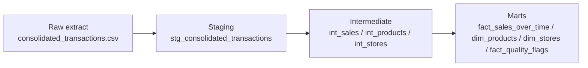

# Retail analytics presentation deck narrative

This document is designed to be read as a presentation brief and converted into a short executive slideshow. It is grounded in the project brief in [ASSIGNMENT.md](../ASSIGNMENT.md), the environment guidance in [README.md](../README.md), and the raw data notes in [data/raw/README.md](../data/raw/README.md).

---

## 1. Executive summary

We took a messy, denormalized retail transaction extract and turned it into a practical analytics pipeline in dbt with DuckDB. The result is a layered model structure that can support executive questions around growth, product and store performance, profit opportunity, and data quality.

The work focuses on three outcomes:

1. Clean and preserve the raw sales detail without losing business context.
2. Normalize the data into usable fact and dimension-style structures.
3. Surface quality issues and business-relevant metrics for decision making.

### Verified headline numbers

- Total revenue tracked in the cleaned model: $46.16M
- Gross margin: $14.22M
- Gross margin rate: 44.6%
- 2022 revenue rose from $1.04M in January to $1.75M in December, with a noticeable Q4 uplift.
- Highest-revenue products: Computers, Dinnerware, and Cookware.
- Highest-revenue stores: Los Angeles, New York City, and San Diego.

---

## 2. The business problem

The CEO wants answers to five practical questions:

- How are sales changing over time?
- Which products, stores, and regions are strongest?
- What drove growth in 2022?
- Where can profit be improved?
- What quality issues require attention?

The source file was intentionally imperfect. It contained repeated product and store attributes, conflicting cost fields, missing identifiers, and a few unusual rows that could represent returns or adjustments. The modeling challenge was not only to clean the data, but to do so in a way that still supports defensible decision making.

---

## 3. What we built

The project was structured into three layers:

### Layer 1: staging

The staging model cleans the source while preserving the row-level business reality. It performs the following tasks:

- Renames fields to snake_case where needed.
- Casts values to appropriate types.
- Trims whitespace and standardizes null handling.
- Flags data-quality issues instead of silently dropping them.

### Layer 2: intermediate

The intermediate layer reshapes the data into more analytic-friendly structures:

- A sales-line model that preserves transaction detail and computes revenue, cost, and margin.
- Product and store models that normalize repeated attributes into reusable structures.

### Layer 3: marts

The marts translate the cleaned data into executive-facing views for business questions. They include:

- A monthly trend view for sales and margin.
- Product and store views for top performers.
- A quality-issues mart to identify anomalies.
- Growth and profit opportunity views to support recommendations.

---

## 4. How the data was transformed

### Source-to-target story

The raw file is a single wide extract with product, store, and region attributes repeated on every line. That structure is useful for a landing file, but not for analytics.

We normalized it into a clearer shape by:

- treating the sales rows as the primary fact grain,
- separating repeated business attributes into reusable dimensions,
- calculating core metrics at the row level,
- and keeping quality flags visible instead of hiding them.

### Core metric definitions

The business logic used in the model is intentionally simple and explainable:

- Revenue = quantity × unit price
- Gross cost = quantity × chosen margin cost
- Gross margin = revenue − gross cost

### Cost choice

One of the most important modeling decisions was how to calculate margin cost. The source contains multiple cost columns: unit_cost, standard_unit_cost, and landed_unit_cost.

We chose the following order for margin cost:

1. standard_unit_cost
2. landed_unit_cost
3. unit_cost

This choice reflects the finance planning note in the raw data README, while still preserving a fallback path for rows where standard cost is missing. The model also flags when standard and landed costs conflict, so the business can see where margin sensitivity exists.

---

## 5. Key cleaning and modeling decisions

### Transaction IDs

Transaction IDs were not treated as guaranteed unique business keys. The assignment notes say they are not unique in the extract, so the model preserves them as cleaned identifiers and flags duplicates instead of assuming uniqueness.

### Missing identifiers

Rows with missing product or store identifiers were preserved and flagged. This is important because dropping them would hide the issue and distort the metrics.

### Negative quantities

Negative quantities were preserved and flagged. They likely represent returns or adjustments, and removing them would distort the operational story.

### Conflicting attributes

The source contains repeated values that do not always agree. The pipeline flags conflicting cost values and leaves the business to decide whether to investigate or apply a different cost convention.

---

## 6. Model format and what each layer represents

### Staging model

The staging model is a light-cleaning layer. It should be considered the business-safe version of the raw extract.

### Intermediate models

These models represent the normalized core of the analytics stack:

- int_sales: row-level sales fact logic
- int_products: normalized product-level structure
- int_stores: normalized store-level structure

### Mart models

These are the presentation-friendly outputs that answer executive questions:

- fact_sales_over_time: monthly trend view
- dim_products: product performance view
- dim_stores: store and regional performance view
- fact_quality_flags: quality issue view
- fact_growth_drivers: growth-oriented view
- fact_profit_opportunities: margin-improvement view

These marts are intentionally simple and explainable. They are meant to support a business conversation, not to mimic a full enterprise semantic layer.

---

## 7. Findings from the data

### Growth over time

Using the cleaned sales model, the business shows a clear revenue pattern across the period. The strongest momentum appears in the latter part of 2022, with revenue rising from $1.04M in January to $1.75M in December.

### Top products

The highest-revenue products in the cleaned dataset include:

- Computers
- Dinnerware
- Cookware
- Candles

### Top stores

The strongest store revenue contributors include:

- Los Angeles
- New York City
- San Diego
- San Francisco

### Quality issues surfaced

The quality mart surfaced a small number of anomalies that are worth reviewing:

- 2 rows with missing product IDs
- 2 rows with missing store IDs
- 4 rows with conflicting costs
- 2 rows with negative quantities

These are not large enough to invalidate the analysis, but they are important enough to be visible to the business.

---

## 8. Recommended narrative for the slides

A strong presentation should tell the story in this order:

### Slide 1 — Title

Retail analytics transformation and executive insights

### Slide 2 — Why this matters

The raw extract was messy, but the business still needs answers now. The solution creates a robust, explainable analytics foundation.

### Slide 3 — How the pipeline works

Raw extract → staging → intermediate → marts

### Slide 4 — What changed in the data model

The project moved from a wide, denormalized file to a more normalized fact-and-dimension-style structure.

### Slide 5 — Major modeling decisions

Cost logic, duplicate IDs, missing identifiers, and negative quantities.

### Slide 6 — Executive metrics

Revenue, gross margin, and margin rate summary.

### Slide 7 — Growth and performance insights

Monthly momentum and top-performing products/stores.

### Slide 8 — Profit opportunities and cautions

Where margin can be improved and where the data needs follow-up.

### Slide 9 — Tradeoffs and next steps

The current model is explainable and practical, but a larger-scale rollout would benefit from a canonical product/store master and a more formal business glossary.

---

## 9. Tradeoffs and considerations

### What we chose

- We preserved row-level detail and surfaced issues rather than silently cleaning them away.
- We used a clear, simple margin definition that is easy to explain.
- We kept the model pragmatic and local, using DuckDB and dbt as requested.

### What we would refine with more time

- Add a stronger product and store master reference to resolve inconsistent naming and missing keys.
- Create more explicit dimension tables if the business wants a more formal semantic layer.
- Add richer KPI views for profitability by category, region, and time period.
- Introduce a more formal agreement on cost definitions with Finance and Operations.

### Why this is a good starting point

The current project is not a perfect enterprise warehouse implementation, but it is a strong analytical foundation. It makes the business questions answerable, leaves the logic auditable, and avoids overfitting the model to a single interpretation of the data.

---

## 10. Closing message for the audience

This project shows that a messy retail extract can be turned into a business-ready decision support workflow with a disciplined dbt approach. The pipeline is transparent, the metrics are explainable, and the data-quality issues are visible rather than hidden. That is exactly what a CEO-facing analytics workflow should do: make the business story clear, trustworthy, and actionable.
